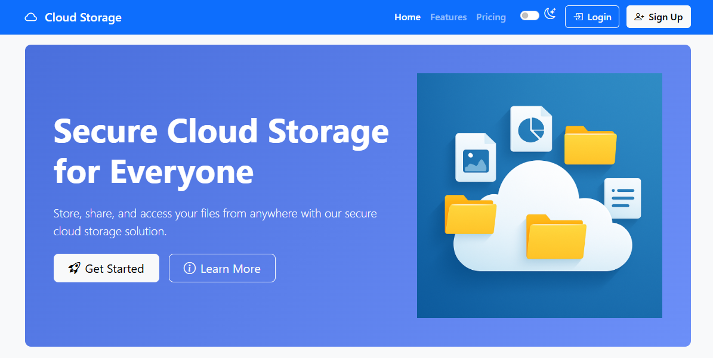

# Cloud Storage System
<h3>📝 Description :</h3> 

A comprehensive cloud-based file storage system similar to OneDrive with email login and access control.
Store, share, and access your files from anywhere with our secure cloud storage solution.

<h3>🌐 Web Link :</h3>

<h4> Live Site: <a href="https://cloudstorage-rr82.onrender.com/" target="_blank">https://cloudstorage-rr82.onrender.com/</a></h4>

### 📃 Features :

- **User Authentication**
  - OAuth 2.0 integration for Google and Microsoft accounts
  - Traditional email/password registration
  - Email verification for security

- **File Management**
  - Upload, download, delete, and organize files/folders
  - Drag-and-drop support
  - File preview for images, PDFs, and documents

- **Access Control & Sharing**
  - Role-based permissions (Admin, User, Guest)
  - Share files via public/private links
  - Set permissions (View/Edit/Download)

- **Cloud Storage**
  - MongoDB Atlas integration
  - Automatic sync across devices

- **Security**
  - AES-256 encryption for stored files
  - Session management & brute-force protection

- **Versioning & Recovery**
  - Track file versions (restore previous versions)
  - Recycle bin for deleted files (30-day retention)

- **Search & Organization**
  - Search files by name, type, or tags
  - Folder structure & favorites system

- **UI/UX**
  - Responsive design for all devices
  - Light and dark theme switching

### Installation in vs code

1. Create a virtual environment:
   ```
   python -m venv venv
   ```
2. Activate the virtual environment:
   - Windows: 
    ```
    venv\Scripts\activate
    ```
3. Install dependencies:
   ```
   pip install -r requirements.txt
   ```
4. Create a `.env` file with the following variables:
   ```
   SECRET_KEY=your_secret_key
   JWT_SECRET_KEY=your_jwt_secret_key
   MONGO_URI=mongodb+srv://<real_user>:<real_password>@cluster0.realdomain.mongodb.net
   ```
### Requirements for deployment on the server.
1. Create a `requirements.txt` file with the following libraries:
   ```
   Flask==3.1.0
   click==8.1.8
   Flask-SQLAlchemy==3.1.1
   Jinja2==3.1.5
   waitress==3.0.2          # Production WSGI server (Windows-friendly)
   gunicorn==23.0.0         # Production WSGI server (Unix)
   Werkzeug==3.1.3          # WSGI utility (Flask dependency)
   requests==2.32.3         # HTTP requests library
   python-dotenv==1.0.1     # Environment variable loader`
   ```
2.  Install the required libraries using:
    ```
    pip install -r requirements.txt
    ```

### Push Code to GitHub from VS Code Turminal (First Time):
1.  To freeze your requirements.txt file:
    ```
    pip freeze > requirements.txt
    ```
2.  Initialize Git in Your Project
    ```
    git init
    ```
3.  Add Files to Staging
    ```
    git add .                      # Stages all files
    ```
4.  Git Status of add files
    ```
    git status
    ```
5.  Commit Changes
    ```
    git commit -m "first commit"
    ```
6.  Create a New Repository on GitHub
    - Go to github.com/new
    - Do not initialize with README/.gitignore (you already have files locally).
7. Link Local Project to GitHub (Example of Repository Link)
    ```
    git remote add origin https://github.com/your-username/repo-name.git
    ```
8. Push Code to GitHub
    ```
    git push -u origin main
    ```
### Home page
<p align="center">
  
  <br>
  <em>Landing Page Preview</em>
</p>

### Usage

1. Run the application on local machine:
   ```
   python app.py
   ```
2. Open your browser and navigate to `http://localhost:5000`
3. Register a new account or log in with existing credentials

### Project Structure

```
cloud_storage_system/
├── static/               # Static assets
│   ├── css/              # CSS stylesheets
│   │   └── main.css      # Main stylesheet
│   ├── js/               # JavaScript files
│   │   └── app.js        # Main JavaScript
│   └── images/           # Images and icons
├── templates/            # HTML templates
│   ├── layout.html       # Base template
│   ├── index.html        # Landing page
│   ├── login.html        # Login page
│   ├── register.html     # Registration page
│   ├── dashboard.html    # User dashboard
│   └── files.html        # File management
├── app.py                # Main application
├── requirements.txt      # Python dependencies
└── README.md             # Project documentation
```

### 🛠️ Technologies Used

- **Backend**: Python Flask
- **Frontend**: HTML, CSS, JavaScript, Bootstrap
- **Database**: MongoDB Atlas
- **Authentication**: JWT, OAuth 2.0
- **Encryption**: AES-256

### 🛡️ License

This project is licensed under the MIT License - see the LICENSE file for details.
